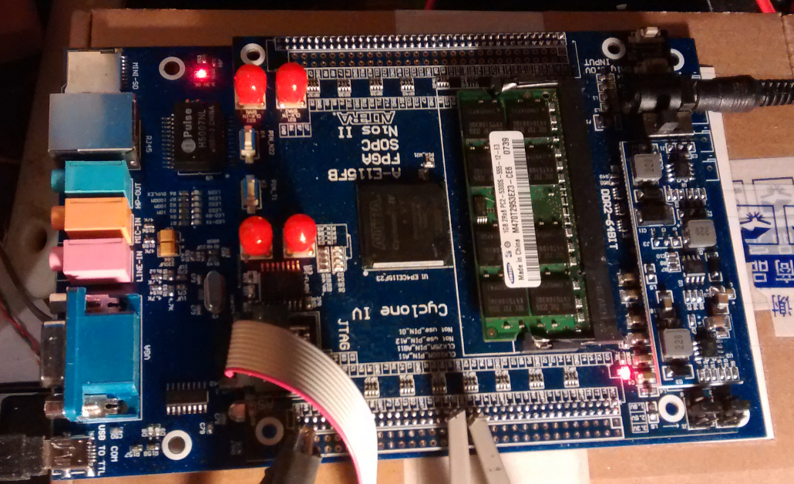

# HermesE115F3
Port of HPSDR Hermes protocol 2 v10.7 to A-E115F3 FPGA board
------------------------------------------------------------

As a radio amateur (PE1NWK) I've been playing around with SDR implementations for quite a while. I'm using existing FPGA boards and connect it to my own hardware boards.

Currently I'm using a general purpose FPGA board, one of those anonymous boards, without a real name. Lets call it A-E115FB as it appears on one of its labels. Anyway, the FGPA is an Altera/Intel Cyclone IV E, EP4CE115F23 type:

[A-115FB](doc/FPGA_board.jpg)

This one was chosen because of the huge amount of LEs and numerous IO ports. The board has usefull peripherals like ethernet, soundcard, EEProm etc. However, it seems this board is not available anymore. 

In this project I am exploring the options to use the excellent Hermes protocol and functional implementation even though my hardware is conceptually different. I am sharing it here in the hope that it can be used with other boards and hardware as well.  

### progress tracking

Updates to this project are committed using pull requests. File changes can be viewed there:

*    PR #2 [Set device to EP4CE115F23I7 and upgraded IP components](https://github.com/MarcoVad/HermesE115F3/pull/2)
*    PR #3 [updated Ethernet 1000Base-T ,added UART SPI I2C I2S debugging](https://github.com/MarcoVad/HermesE115F3/pull/3)
